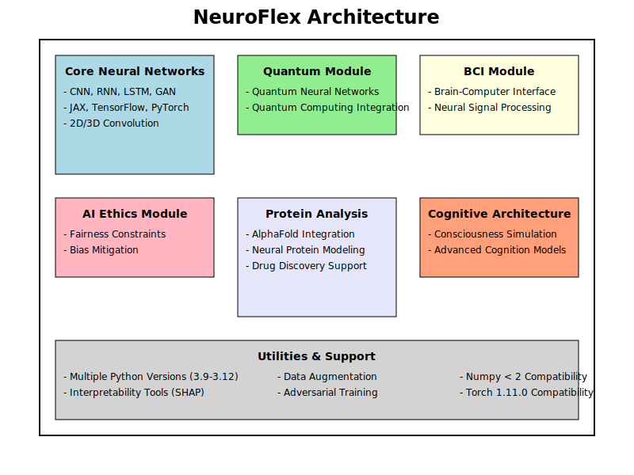

# NeuroFlex: Advanced Neural Network Framework (v0.1.2)

NeuroFlex is a cutting-edge neural network framework built on JAX, Flax, and TensorFlow, designed to address key challenges in modern machine learning: interpretability, generalization, robustness, and fairness. This project showcases state-of-the-art techniques and methodologies for creating more transparent, reliable, and ethical AI systems.



## Key Features

- **Advanced Neural Architectures**: Support for CNN, RNN, LSTM, GAN, and Spiking Neural Networks
- **Multi-Backend Integration**: Seamless integration with JAX, Flax, and TensorFlow
- **2D and 3D Convolutions**: Efficient implementation of both 2D and 3D convolutional layers
- **Quantum Computing**: Quantum Neural Network module for next-generation AI
- **Reinforcement Learning**: Advanced capabilities with enhanced self-curing algorithms
- **Brain-Computer Interface (BCI)**: Cutting-edge integration for neurotechnology applications
- **Ethical AI**: Fairness constraints and bias mitigation techniques
- **Robustness**: Improved adversarial training, interpretability tools (SHAP), and adaptive learning rate adjustment
- **Bioinformatics**: AlphaFold integration for protein structure prediction and drug discovery
- **Generative AI**: Creative problem-solving and content generation
- **Natural Language Processing**: Sentence piece integration and advanced NLP tasks
- **Neuromorphic Computing**: Energy-efficient spiking neural networks
- **Self-Healing**: Advanced diagnostic and healing processes for improved model performance and stability

## Latest Updates (v0.1.2)

- TensorFlow Integration: Added support for TensorFlow backend alongside JAX/Flax
- 2D and 3D Convolutions: Implemented efficient convolutional layers for both 2D and 3D inputs
- Enhanced Compatibility: Improved interoperability between JAX/Flax and TensorFlow
- Comprehensive Testing: Developed and passed pytest tests for all components, including TensorFlow integration
- Enhanced self-curing mechanism with adaptive learning rate adjustment
- Improved model robustness against gradient explosions and local minima
- Advanced diagnostic checks for model performance and training issues
- Whisper API integration for advanced speech recognition
- Enhanced AlphaFold integration for protein structure prediction
- Advanced consciousness simulation for cognitive modeling
- Improved Brain-Computer Interface (BCI) functionality
- Support for Python 3.9, 3.10, 3.11, 3.12
- Resolved dependency issues and improved stability
- Implemented CI/CD pipeline using GitHub Actions for automated testing and deployment

## Installation

```bash
pip install neuroflex
```

## Quick Start Guide

1. **Import NeuroFlex**

```python
from neuroflex import NeuroFlexNN, train_model, create_neuroflex_nn
```

2. **Define Your Model**

```python
model = create_neuroflex_nn(
    features=[64, 32, 10],
    input_shape=(1, 28, 28, 1),
    output_shape=(1, 10),
    use_cnn=True,
    conv_dim=2,
    backend='tensorflow'  # or 'jax' for JAX/Flax backend
)
```

3. **Train Your Model**

```python
trained_state, trained_model = train_model(
    model, train_data, val_data,
    num_epochs=10, batch_size=32, learning_rate=1e-3
)
```

4. **Make Predictions**

```python
predictions = trained_model(test_data)
```

## Advanced Usage

### TensorFlow Convolutions

```python
from neuroflex import TensorFlowConvolutions

tf_conv = TensorFlowConvolutions(
    features=(32, 64, 128),
    input_shape=(1, 28, 28, 1),
    conv_dim=2  # Use 3 for 3D convolutions
)
model = tf_conv.create_model()
```

### JAX/Flax and TensorFlow Compatibility

```python
from neuroflex.utils import convert_array

jax_array = jax.random.uniform(jax.random.PRNGKey(0), shape=(1, 28, 28, 1))
tf_tensor = convert_array(jax_array, 'tensorflow')
```

### Adversarial Training

```python
from neuroflex import adversarial_training

perturbed_data = adversarial_training(model, params, input_data, epsilon=0.1, step_size=0.01)
```

## Testing

We have developed comprehensive pytest tests for all components, including the TensorFlow integration. To run the tests:

```bash
pytest tests/
```

Key test files:
- `test_neuroflex_nn.py`: Tests for the core NeuroFlexNN functionality
- `test_tensorflow_convolutions.py`: Tests for TensorFlow convolution implementations

## Environment Setup

NeuroFlex supports multiple operating systems:
- Ubuntu
- Windows
- macOS

To set up your environment:

1. Clone the repository:
   ```bash
   git clone https://github.com/neuroflex/neuroflex.git
   ```
2. Create a virtual environment:
   ```bash
   python -m venv neuroflex-env
   ```
3. Activate the environment:
   - Ubuntu/macOS: `source neuroflex-env/bin/activate`
   - Windows: `neuroflex-env\Scripts\activate`
4. Install dependencies:
   ```bash
   pip install -r requirements.txt
   ```

## Documentation

For detailed documentation, including API references and tutorials, visit our [official documentation](https://neuroflex.readthedocs.io).

## Contributing

We welcome contributions! Please see our [contributing guidelines](CONTRIBUTING.md) for more information on how to get started.

## License

This project is licensed under the MIT License - see the [LICENSE](LICENSE) file for details.

## Citation

If you use NeuroFlex in your research, please cite:

```bibtex
@software{neuroflex2024,
  author = {kasinadhsarma},
  title = {NeuroFlex: Advanced Neural Network Framework},
  year = {2024},
  url = {https://github.com/VishwamAI/NeuroFlex}
}
```

## Contact

For questions, feedback, or support, please open an issue on our [GitHub repository](https://github.com/VishwamAI/NeuroFlex/issues) or contact us at [REDACTED SECRET].
