# NeuroFlex Project Task Visualization

## Project Structure Overview

```mermaid
graph TD
    A[NeuroFlex Project] --> B[Core Neural Networks]
    A --> C[Reinforcement Learning]
    A --> D[Cognitive Architectures]
    A --> E[BCI Integration]
    A --> F[Quantum Neural Networks]
    A --> G[AI Ethics]
    A --> H[Generative Models]
    A --> I[Scientific Domains]
    A --> J[Config]
    A --> K[Utils]
    A --> L[Framework-specific Modules]
    A --> M[Advanced Models]
    A --> N[NLP Models]
    A --> O[Explainable AI]
    A --> P[Edge AI and Optimization]
    A --> Q[AutoML]
    A --> R[Federated Learning]
    A --> S[Computer Vision]
    A --> T[Training Scripts]
    A --> U[Miscellaneous]
```

## Task Status

| Category | Total Tasks | Completed | Pending |
|----------|-------------|-----------|---------|
| Core Neural Networks | 10 | 8 | 2 |
| Reinforcement Learning | 3 | 0 | 3 |
| Cognitive Architectures | 3 | 0 | 3 |
| BCI Integration | 1 | 0 | 1 |
| Quantum Neural Networks | 2 | 0 | 2 |
| AI Ethics | 2 | 0 | 2 |
| Generative Models | 5 | 0 | 5 |
| Scientific Domains | 5 | 0 | 5 |
| Config | 2 | 0 | 2 |
| Utils | 8 | 1 | 7 |
| Framework-specific Modules | 8 | 4 | 4 |
| Advanced Models | 3 | 0 | 3 |
| NLP Models | 3 | 0 | 3 |
| Explainable AI | 1 | 0 | 1 |
| Edge AI and Optimization | 2 | 0 | 2 |
| AutoML | 1 | 0 | 1 |
| Federated Learning | 1 | 0 | 1 |
| Computer Vision | 1 | 0 | 1 |
| Training Scripts | 2 | 0 | 2 |
| Miscellaneous | 3 | 1 | 2 |
| Additional Tasks | 8 | 4 | 4 |

## Detailed Task List

### Core Neural Networks
- [x] Move advanced_thinking.py to core_neural_networks/
- [x] Move machinelearning.py to core_neural_networks/
- [x] Move advanced_nn.py to core_neural_networks/
- [x] Move advanced_nn_backup.py to core_neural_networks/
- [x] Move cnn.py to core_neural_networks/
- [x] Move lstm.py to core_neural_networks/
- [x] Move rnn.py to core_neural_networks/
- [x] Move model.py to core_neural_networks/
- [ ] Update import statements in core_neural_networks files
- [ ] Create __init__.py file in core_neural_networks/

### Reinforcement Learning
- [ ] Move rl_module.py to reinforcement_learning/
- [ ] Move reinforcement_learning_advancements.py to reinforcement_learning/
- [ ] Move self_curing_rl.py to reinforcement_learning/

### Cognitive Architectures
- [ ] Move cognitive_architecture.py to cognitive_architectures/
- [ ] Move consciousness_simulation.py to cognitive_architectures/
- [ ] Move extended_cognitive_architectures.py to cognitive_architectures/

### BCI Integration
- [ ] Move art_integration.py to bci_integration/

### Quantum Neural Networks
- [ ] Move quantum_nn_module.py to quantum_neural_networks/
- [ ] Move quantum_module.py to quantum_neural_networks/

### AI Ethics
- [ ] Move aif360_integration.py to ai_ethics/
- [ ] Move ethical_ai_framework.py to ai_ethics/

### Generative Models
- [ ] Move vision_transformer.py to generative_models/
- [ ] Move gan.py to generative_models/
- [ ] Move vae.py to generative_models/
- [ ] Move ddpm.py to generative_models/
- [ ] Move generative_ai.py to generative_models/

### Scientific Domains
- [ ] Move bioinformatics_integration.py to scientific_domains/bioinformatics/
- [ ] Move scikit_bio_integration.py to scientific_domains/bioinformatics/
- [ ] Move ete_integration.py to scientific_domains/bioinformatics/
- [ ] Move alphafold_integration.py to scientific_domains/bioinformatics/
- [ ] Move synthetic_biology_insights.py to scientific_domains/biology/

### Config
- [ ] Move __init__.py to config/ (after removing imports and keeping only version)
- [ ] Move config.py to config/

### Utils
- [ ] Move array_libraries.py to utils/
- [ ] Move lale_integration.py to utils/
- [ ] Move neunets_integration.py to utils/
- [ ] Move xarray_integration.py to utils/
- [ ] Move tokenisation.py to utils/
- [ ] Move tokenizer.py to utils/
- [ ] Move utils.py to utils/
- [x] Move data_loader.py to core_neural_networks/

### Framework-specific Modules
- [x] Move jax_module.py to core_neural_networks/jax/
- [ ] Move tensorflow_module.py to core_neural_networks/tensorflow/
- [ ] Move pytorch_module.py to core_neural_networks/pytorch/
- [ ] Move tensorflow_convolutions.py to core_neural_networks/tensorflow/
- [ ] Move pytorch_integration.py to core_neural_networks/pytorch/
- [x] Create jax/ directory in core_neural_networks/
- [x] Create tensorflow/ directory in core_neural_networks/
- [x] Create pytorch/ directory in core_neural_networks/

### Advanced Models
- [ ] Move advanced_math_solving.py to advanced_models/
- [ ] Move advanced_time_series_analysis.py to advanced_models/
- [ ] Move multi_modal_learning.py to advanced_models/

### NLP Models
- [ ] Move nlp_models.py to nlp_models/
- [ ] Move sentence_piece_integration.py to nlp_models/
- [ ] Move whisper_integration.py to nlp_models/

### Explainable AI
- [ ] Move explainable_ai.py to explainable_ai/

### Edge AI and Optimization
- [ ] Move edge_ai_optimization.py to edge_ai/
- [ ] Move neuromorphic_computing.py to edge_ai/

### AutoML
- [ ] Move automl.py to automl/

### Federated Learning
- [ ] Move federated_learning.py to federated_learning/

### Computer Vision
- [ ] Move detectron2_integration.py to computer_vision/

### Training Scripts
- [ ] Move train_model.py to training_scripts/
- [ ] Move train_model_pytorch.py to training_scripts/

### Miscellaneous
- [ ] Move destroy_button.py to utils/ (or remove if not needed)
- [ ] Move main.py to root directory
- [x] Move cd_stdp.py to core_neural_networks/ (moved, but purpose still needs verification)

### Additional Tasks
- [x] Create missing directories: docs/, examples/, tests/
- [x] Ensure all specified directories are present in the project structure
- [ ] Review and categorize files that don't fit into the current structure
- [x] Create __init__.py files in all new directories
- [x] Update project-wide import statements after file relocations
- [ ] Review and update project documentation to reflect new structure
- [ ] Verify that all files are accounted for in the new structure
- [ ] Update README.md to reflect the new project structure and features

## Notes
1. Create new directories as needed
2. Update imports in files after moving
3. Consider creating __init__.py files in new directories
4. Review and update documentation
5. Update any build scripts or configuration files
6. Run tests after reorganization to ensure everything still works
7. Investigate the purpose of 'Q*.py' files and categorize them appropriately
8. Review and potentially merge similar files (e.g., tokenisation.py and tokenizer.py)
9. Ensure all core functionalities are preserved in the new structure
10. Double-check that no files are left in the old structure after reorganization

## Specialized Task Lists

### EdgeAI
- [ ] Implement advanced optimization techniques for edge deployment
- [ ] Add comprehensive model quantization and pruning methods
- [ ] Enhance error handling and logging mechanisms
- [ ] Develop methods for hardware-specific optimizations
- [ ] Implement model compression techniques (e.g., knowledge distillation)

### SyntheticBiologyInsights
- [ ] Develop advanced genetic circuit design and analysis functionality
- [ ] Implement comprehensive metabolic pathway simulation
- [ ] Integrate with AlphaFold for protein structure prediction
- [ ] Add support for CRISPR gene editing simulations
- [ ] Implement machine learning models for protein function prediction

### Tokenizer
- [ ] Upgrade to use SentencePiece or a similar advanced tokenization library
- [ ] Implement handling of special tokens and characters
- [ ] Add support for subword tokenization
- [ ] Implement byte-pair encoding (BPE) tokenization
- [ ] Add support for multilingual tokenization
- [ ] Implement token caching for improved performance
